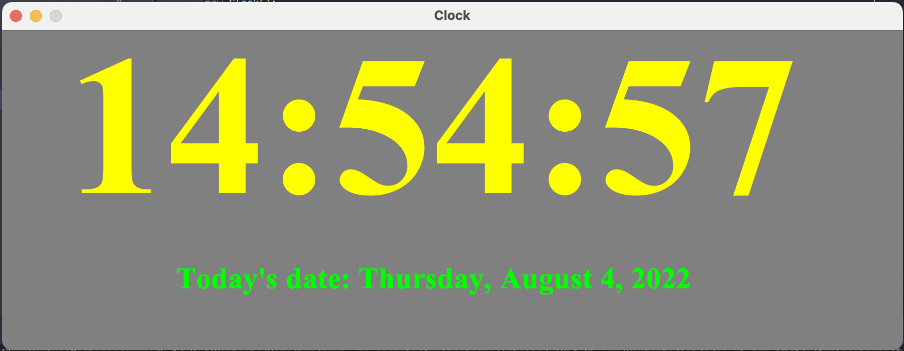

# Clock Application

> A simple application that displays the time and date currently.


A simple application to practice JFrames, try-catch exceptions, and threads.



## Installation

OS X & Linux:

```sh
* Download zip file

* Open terminal and CD into the main file directory

* Run the main.java using "Java main" in terminal
```

Windows:

```sh
* Download zip file

* Open CMD or powershell and CD into the main file directory

* Run the main.java using "Java main" in CMD or powershell
```

## Release History

* 0.0.1
    * Initial Commit - Version 1

## Contributing

1. Fork it (<https://github.com/yourname/yourproject/fork>)
2. Create your feature branch
3. Commit your changes
4. Push to the branch 
5. Create a new Pull Request
